# 웹 디자인 프로젝트

[toc]

## 기술 스택 정리


## 프로젝트 기능 리스트 업


```
📦 경쟁 컨텐츠
├─ 모집
│  ├─ 방장이 챌린지 만들기 (ex: 1일 1만두 챌린지)
│  └─ 일반 유저가 챌린지 참
├─ 경쟁
│  ├─ 매칭:
│  │  ├─ 대주제: 비슷한 시간대
│  │  ├─ 중주제: 비슷한 주제
│  │  └─ 시스템이 정하는 방식
│  │     └─ 보험: 붙어보자 탭 증설 계획
│  └─ 기간 동안 
│     ├─ 현재 점수 
│     ├─ 상대방 챌린지 피드
│     ├─ 우리 챌린지 피드
│     └─ 상대방 챌린지 달성율
├─ 결과
│  ├─ 챌린지 경쟁 결과
│  │  ├─ 참여도 점수
│  │  ├─ 지속율 (참가 인원 및 참가 기간에 따른 가산 적용)
│  │  └─ (텍스트, 이미지, 비디오 등 참여도 차등)
│  │     └─ 포인트로 대체할 수 있음
│  ├─ 시즌제 결과
│  │  ├─ 시즌에 참가한 챌린지 보상
│  │  ├─ 개인 보상
│  │  └─ 굼벵이 상 (사실상 블랙리스트)
│  └─ 결과에 따른 보상
│     ├─ 뱃지 시스템
│     └─ 최근 획득한 뱃지를 프로필에 보여준다.
│        └─ 혹은 뱃지 도감 
├─ -----------------------------------------------------------------
├─ 피드 
│  ├─ 단체 챌린지 방
│  └─ 자신이 가입한 챌린지
├─ 검색
│  ├─ 챌린지 검색
│  ├─ 아이디 검색
│  └─ 카테고리 검색
├─ 알림
│  ├─ 출석체크 알림
│  ├─ 팔로우 알림
│  ├─ 댓글, 새글, 인증글 알림
│  └─ 방장, 챌린지 장 (새로운 참가자 알림)
└─ 프로필
   ├─ 팔로우, 팔로잉
   ├─ 완료한 챌린지
   ├─ 완료한 챌린지 보상 - 뱃지
   ├─ 진행 중인 챌린지
   ├─ 관심 있는 챌린지
   └─ 통계 및 데이터 챌린지
```


## 프로젝트 일정

```mermaid
gantt
    dateFormat  MM-DD
    title       오렌지팀

    section 기획
    주제 선정				  :done, 07-19, 3d
    기능 목록 상세 도출			:done, 07-19, 3d
    화면 기획				  :done, 07-21, 4d
    개발 환경 구성             :done, 07-22, 5d
	
	section Frontend
    notification		  	:done, 07-26, 5d
    auth	 :done, 07-28, 5d
	develp->master :done, 07-29,1d
    profile	 	 		:done, 08-02,5d
    feed   	  		:done, 08-04, 4d
   	develp->master :done, 08-05,1d
    develp->master :done, 08-12,1d
	Challange		 	   :done, 08-06,7d
	search                 :done, 08-12, 2d
	api-sync :done,08-11, 6d

	
    section Mobile
    Feed		  	:done, 07-26, 5d
    notification	 :done, 07-28, 5d
   	FCM              :done, 07-28, 5d
    develp->master :done, 07-29,1d
    develp->master :done, 08-05,1d
    develp->master :done, 08-12,1d
	auth   	  		:done, 07-31, 4d
	aws ec2 setting  :done, 08-03, 2d
    profile	 	 		:done, 08-02,5d
	Challange		 	   :done, 08-06,7d
	search                 :done, 08-12, 2d
		api-sync :done,08-11, 6d

	
    section Backend
    auth   	  		:done, 07-27, 4d
    JPA 학습 			:done, 07-28, 4d
    profile	 	 		:done, 07-28,5d
    develp->master :done, 07-29,1d
    develp->master :done, 08-05,1d
    develp->master :done, 08-12,1d
    search                 :done, 08-01, 3d
    contrller level :done, 08-02, 7d
    Feed		  	:done, 08-01, 5d
    notification	 :done, 08-03, 5d
	Challange		 	   :done, 08-06,9d
	sync (unit)                   :done, 08-14, 2d 
	
	section DevOps
	docker-compose deploy passive :done, 08-06, 2d
	docker-compose pipeline with gitlab :done, 08-08, 1d
	docker-compose automation ci/cd :done, 08-09,3d
	


	section 문서 정리 및 마무리
    QA 및 버그 찾기               :done, 08-16, 3d
    
    section 기타
    UCC제작 :done, 08-18 2d
    발표준비 :done, 08-18, 2d
```


