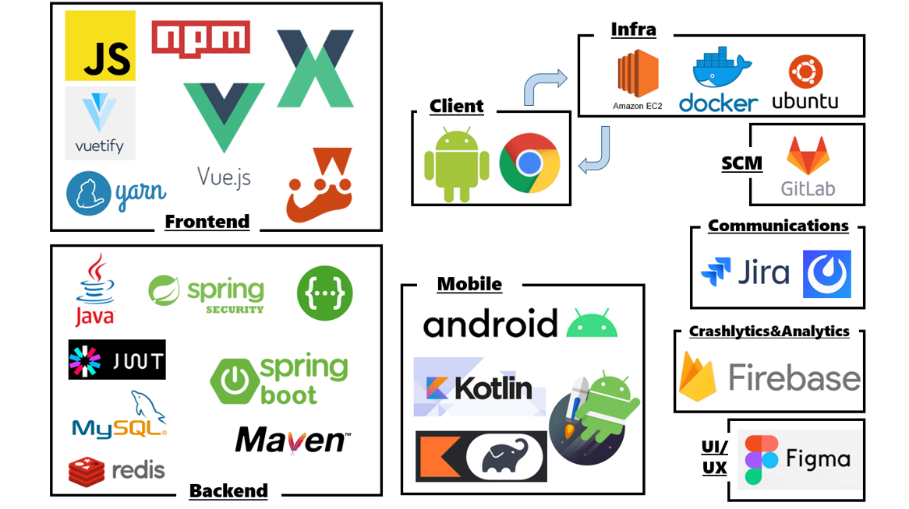

# Orange 
### 의지가 부족한 사람들을 위한 경쟁형 챌린지 SNS

<br>

## 목차
1. [개요](#개요)
2. [프로젝트 기능 리스트 업](#프로젝트-기능-리스트-업)
3. [화면정의서](#화면정의서)
4. [기술스택](#기술스택)
5. [주요기능](#주요기능)
6. [프로젝트 일정](#프로젝트-일정)

<br>


## 개요
> ### 멤버 소개
> | 이름   | 담당                                        |
> | ------ | ------------------------------------------- |
> | 김재현 | TeamLeader, Mobile ,DevOps, QA              |
> | 김예림 | BackEnd, User CRUD, JWT, SpringSecurity, QA |
> | 배세영 | BackEnd,Challenge Business Logic, QA        |
> | 임성준 | BackEnd,Feed Business Logic, QA             |
> | 한훈희 | FrontEnd, UCC, QA                           |
>
> ### 개발 기간
> >  2021.07.12 - 2021.08.20
> ### 기획배경
> - 건강에 대한 꾸준한 관심을 기울이며 삶의 질 향상과 건강 관리를 위해 노력하는 MZ세대
> - 관심도에 비해 소득이나 동반 참여자의 부재로 운동을 포기하는 사람 다수
> - 선행되는 서비스에는 돈에 너무 크게 치중되고 알림기능이 없어 불편한 점을 얘기하는 후기 존재
> - 돈을 이용해 의지말고 다른 사람들과 함께하고, 경쟁하며 의지를 다질 수 있는 서비스 기획
> - 사용자들이 흥미를 느끼고 지속적으로 이용할 수 있도록 게이미피케이션 요소 추가

<br>
<br>


## 프로젝트 기능 리스트 업

```
📦 경쟁 컨텐츠
├─ 모집
│  ├─ 방장이 챌린지 만들기 (ex: 1일 1만두 챌린지)
│  └─ 일반 유저가 챌린지 참
├─ 경쟁
│  ├─ 매칭:
│  │  ├─ 대주제: 비슷한 시간대
│  │  ├─ 중주제: 비슷한 주제
│  │  └─ 시스템이 정하는 방식
│  │     └─ 보험: 붙어보자 탭 증설 계획
│  └─ 기간 동안 
│     ├─ 현재 점수 
│     ├─ 상대방 챌린지 피드
│     ├─ 우리 챌린지 피드
│     └─ 상대방 챌린지 달성율
├─ 결과
│  ├─ 챌린지 경쟁 결과
│  │  ├─ 참여도 점수
│  │  ├─ 지속율 (참가 인원 및 참가 기간에 따른 가산 적용)
│  │  └─ (텍스트, 이미지, 비디오 등 참여도 차등)
│  │     └─ 포인트로 대체할 수 있음
│  ├─ 시즌제 결과
│  │  ├─ 시즌에 참가한 챌린지 보상
│  │  ├─ 개인 보상
│  │  └─ 굼벵이 상 (사실상 블랙리스트)
│  └─ 결과에 따른 보상
│     ├─ 뱃지 시스템
│     └─ 최근 획득한 뱃지를 프로필에 보여준다.
│        └─ 혹은 뱃지 도감 
├─ -----------------------------------------------------------------
├─ 피드 
│  ├─ 단체 챌린지 방
│  └─ 자신이 가입한 챌린지
├─ 검색
│  ├─ 챌린지 검색
│  ├─ 아이디 검색
│  └─ 카테고리 검색
├─ 알림
│  ├─ 출석체크 알림
│  ├─ 팔로우 알림
│  ├─ 댓글, 새글, 인증글 알림
│  └─ 방장, 챌린지 장 (새로운 참가자 알림)
└─ 프로필
   ├─ 팔로우, 팔로잉
   ├─ 완료한 챌린지
   ├─ 완료한 챌린지 보상 - 뱃지
   ├─ 진행 중인 챌린지
   ├─ 관심 있는 챌린지
   └─ 통계 및 데이터 챌린지
```

<br>
<br>


## 화면정의서
### [Link](https://www.figma.com/file/2ihD4rKxnWhyDipzKvdK2n/Orange?node-id=0%3A1&viewport=337%2C-193%2C0.08455798774957657)

<br>
<br>


## 기술스택

[목차로 돌아가기](#목차)

<br>
<br>


## 주요기능
| 기능 | Web | Mobile |
| -- | --------------- | --------------- |
| 메인화면 | | |
|회원가입|||
|로그인|||
| 챌린지생성 |  |  |
| 챌린지내게시글 | .png) | .png) |
| 그룹챌린지경쟁현황 |  |  |
| 챌린지랭킹 |                  |  |
| 미션뱃지수여 |          |  |
| 알림창 |  |  |
<br>

|기능|Web|
| ----- | ----------------- |
| 챌린지 내 댓글  |  |

<br>

|응원하기|최근검색어|검색|마이페이지|
| ----- | ----- | ----- | ----- |
|  |  |  ||


[목차로 돌아가기](#목차)

<br>
<br>

## 프로젝트 일정


[목차로 돌아가기](#목차)