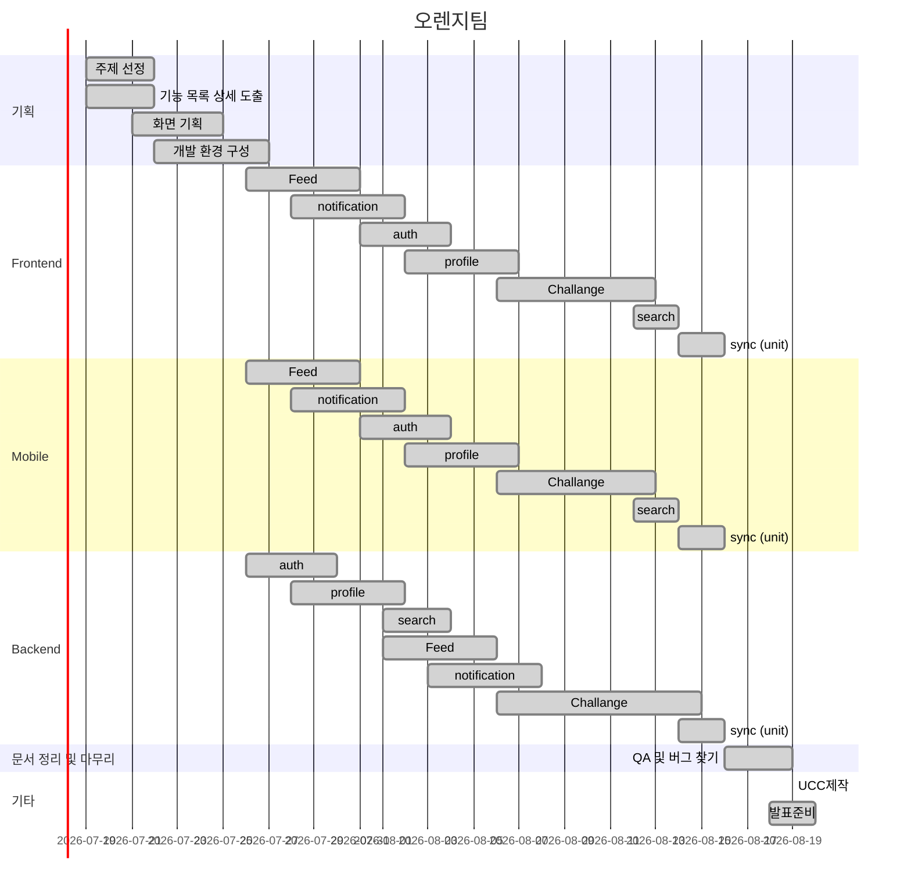

# 웹 디자인 프로젝트

[toc]

## 프로젝트 기능 리스트 업

📦 경쟁 컨텐츠
├─ 모집
│  ├─ 방장이 챌린지 만들기 (ex: 1일 1만두 챌린지)
│  └─ 일반 유저가 챌린지 참
├─ 경쟁
│  ├─ 매칭:
│  │  ├─ 대주제: 비슷한 시간대
│  │  ├─ 중주제: 비슷한 주제
│  │  └─ 시스템이 정하는 방식
│  │     └─ 보험: 붙어보자 탭 증설 계획
│  └─ 기간 동안 
│     ├─ 현재 점수 
│     ├─ 상대방 챌린지 피드
│     ├─ 우리 챌린지 피드
│     └─ 상대방 챌린지 달성율
├─ 결과
│  ├─ 챌린지 경쟁 결과
│  │  ├─ 참여도 점수
│  │  ├─ 지속율 (참가 인원 및 참가 기간에 따른 가산 적용)
│  │  └─ (텍스트, 이미지, 비디오 등 참여도 차등)
│  │     └─ 포인트로 대체할 수 있음
│  ├─ 시즌제 결과
│  │  ├─ 시즌에 참가한 챌린지 보상
│  │  ├─ 개인 보상
│  │  └─ 굼벵이 상 (사실상 블랙리스트)
│  └─ 결과에 따른 보상
│     ├─ 뱃지 시스템
│     └─ 최근 획득한 뱃지를 프로필에 보여준다.
│        └─ 혹은 뱃지 도감 
├─ -----------------------------------------------------------------
├─ 피드 
│  ├─ 단체 챌린지 방
│  └─ 자신이 가입한 챌린지
├─ 검색
│  ├─ 챌린지 검색
│  ├─ 아이디 검색
│  └─ 카테고리 검색
├─ 알림
│  ├─ 출석체크 알림
│  ├─ 팔로우 알림
│  ├─ 댓글, 새글, 인증글 알림
│  └─ 방장, 챌린지 장 (새로운 참가자 알림)
└─ 프로필
   ├─ 팔로우, 팔로잉
   ├─ 완료한 챌린지
   ├─ 완료한 챌린지 보상 - 뱃지
   ├─ 진행 중인 챌린지
   ├─ 관심 있는 챌린지
   └─ 통계 및 데이터 챌린지

## 프로젝트 일정

